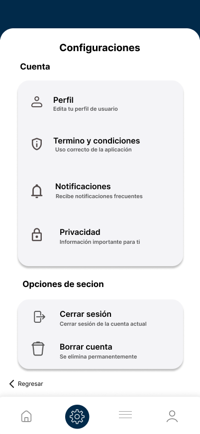
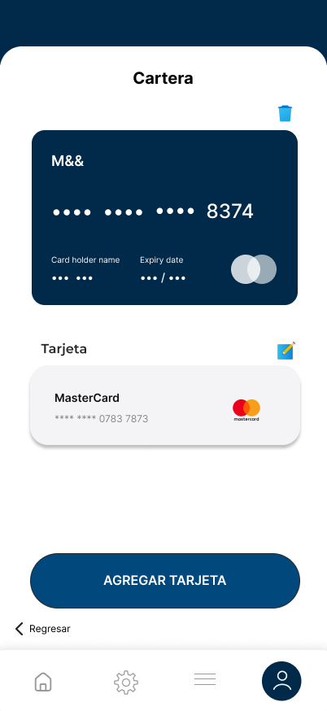

# FixYa 📌

  <picture>
    
  </picture>

**Bienvenido(a) al repositorio de FixYa**, una plataforma en desarrollo que conecta a los usuarios con proveedores de servicios de limpieza y mantenimiento, ofreciendo soluciones rápidas y confiables para el hogar.

---

## :star: Estado del Proyecto
> **Estado Actual:** En Desarrollo  
> **Próximos Pasos:** Integración de nuevas funcionalidades, refinamiento de la interfaz y realización de pruebas internas.

---

## :floppy_disk: Tabla de Contenidos
1. [Características Principales](#características-principales)  
2. [Arquitectura de la Plataforma](#arquitectura-de-la-plataforma)  
3. [Objetivo del Proyecto](#objetivo-del-proyecto)  
4. [Diseños de la App](#capturas-de-pantalla)  
5. [Contribución](#contribución)

---

## :page_with_curl: Características Principales
- **Servicios de Limpieza y Mantenimiento**  
  Ofrece un catálogo de servicios confiables para el hogar, cubriendo necesidades de limpieza profunda, reparaciones básicas y más.

- **Proceso de Solicitud Rápido**  
  Permite a los usuarios solicitar servicios en pocos pasos:  
  - Ver horarios, costos e información detallada.  
  - Confirmar la contratación con un solo clic.

- **Asignación de Proveedores**  
  Sistema de gestión para que los proveedores tomen solicitudes según su disponibilidad y experiencia:  
  - Notificaciones en tiempo real cuando hay un trabajo disponible.  
  - Herramientas de comunicación integradas para facilitar la coordinación.

- **Suscripción para Proveedores**  
  Modelo de negocio que brinda a los proveedores más oportunidades de trabajo y evita comisiones por cada servicio:  
  - Suscripción flexible y sin penalizaciones.  
  - Mayor visibilidad y expansión de su cartera de clientes.

- **Evaluaciones y Retroalimentación**  
  Los residentes pueden calificar y dejar comentarios sobre los servicios recibidos, fomentando la transparencia y la mejora continua.

---

## :construction: Arquitectura de la Plataforma
1. **Aplicación Móvil (Usuarios)**  
   - Explora servicios disponibles, revisa detalles y costos, y solicita servicios de limpieza o mantenimiento.  
   - Sección de evaluación y retroalimentación para calificar la experiencia con el proveedor asignado.

2. **Plataforma Web (Proveedores)**  
   - Diseñada para profesionales independientes en busca de más oportunidades de trabajo.  
   - Reciben y confirman solicitudes, gestionan su disponibilidad y se comunican con los clientes.  
   - Modelo de suscripción para eliminar comisiones por cada servicio, favoreciendo una relación directa entre proveedor y usuario.

3. **Base de Datos y Gestión**  
   - Administra la información de clientes, solicitudes y valoraciones para optimizar la experiencia de usuario.  
   - Incluye un proceso de validación y registro de proveedores, asegurando la calidad del servicio.

---

## :clipboard: Objetivo del Proyecto
El propósito de **FixYa** es resolver la dificultad de encontrar servicios de limpieza y mantenimiento confiables. A través de una interfaz intuitiva y un sistema de suscripción para proveedores, se busca:

- **Facilitar** la vida de los residentes al ofrecer un catálogo de servicios de alta calidad.  
- **Optimizar** la comunicación y coordinación entre usuarios y proveedores.  
- **Garantizar** transparencia y confianza en cada interacción.

---

## :camera_flash: Diseños de la App
> **Nota:** A continuación se muestra un breve recorrido por la aplicación. Estas capturas representan una versión preliminar de **FixYa** y pueden variar en la versión final.

---

### 1. Perfil de Usuario
**Descripción:** Aquí el usuario puede ver y editar su información personal, actualizar su foto de perfil y gestionar sus preferencias.  

  <picture>
    
  </picture>

---

### 2. Pantalla Principal
**Descripción:** La pantalla de inicio muestra un resumen de los servicios disponibles, promociones y accesos directos a secciones clave de la aplicación.  

  <picture>
    
  </picture>

---

### 3. Antes del Inicio de Sesión
**Descripción:** Esta pantalla ofrece la opción de iniciar sesión, registrarse o continuar con un acceso limitado, para que el usuario conozca las principales características antes de crear una cuenta.  

  <picture>
    
  </picture>

---

### 4. Configuraciones
**Descripción:** Desde este apartado, los usuarios pueden personalizar las notificaciones, cambiar la contraseña, y configurar otros aspectos de la aplicación para adaptarla a sus necesidades.  

  <picture>
    
  </picture>

---

### 5. Cartera
**Descripción:** Aquí se gestionan los métodos de pago, el historial de transacciones y los detalles de facturación para servicios futuros.  

  <picture>
    
  </picture>

---

> **Advertencia:** Al estar en desarrollo, la apariencia y funcionalidades de estas pantallas podrían cambiar en próximas versiones.  

---

## :handshake: Contribución
A continuación, reconocemos y agradecemos a todas las personas que han contribuido directa o indirectamente al desarrollo de **FixYa**. Cada aportación, desde la programación hasta el diseño y las pruebas, ha sido fundamental para construir esta plataforma.  

### Equipo de Desarrollo
- **Nombre del Desarrollador/a** – *Rol/Responsabilidades principales*  
- **Nombre del Desarrollador/a** – *Rol/Responsabilidades principales*  
- **Nombre del Desarrollador/a** – *Rol/Responsabilidades principales*  
- *(Agrega tantas líneas como sea necesario)*

### Formas de Participar
Si deseas formar parte de nuestro equipo o colaborar con ideas, sugerencias o mejoras, por favor revisa los [Issues](#) y crea un nuevo *issue* o *pull request* con tu propuesta.  
¡Cualquier retroalimentación es muy bienvenida!

---

## <picture>  </picture> Métricas e Información del Proyecto

  
<h3>🔍 Análisis de Rendimiento</h3>

  *En esta sección puedes mostrar estadísticas clave de rendimiento de la aplicación, como el rendimiento del backend, tiempos de respuesta o métricas de carga.*  
  

    <!-- Ejemplo de gráfico o reporte de rendimiento -->
    
  

  
  > **Ejemplo**: Puedes usar herramientas como **JMeter**, **k6**, **Locust** u otras para generar reportes y colocar aquí una imagen o enlace.

  
<h3>🛠️ Calidad del Código y Cobertura</h3>

  *Aquí se pueden incluir resultados de pruebas unitarias, cobertura de código y otras estadísticas de calidad.*  
  

    <!-- Ejemplo de reporte de cobertura -->
    
    
  

  <b>Nota:</b> *Puedes reemplazar estos gráficos con herramientas de cobertura como **Istanbul**, **Codecov** o **Coveralls**, entre otras.*
  

  
<h3>🗂️ Registro de Cambios</h3>

  *Muestra de manera visual los commits, liberaciones de nuevas versiones o hitos alcanzados en el desarrollo de la app.*  
  

    <!-- Ejemplo de gráfico de actividad -->
    
  

  > **Tip:** Para el control de versiones, puedes valerte de *tags*, *releases* y la sección de *Projects* e *Issues* en GitHub.

  
<h3>🏆 Reconocimientos</h3>

  *Espacio para compartir cualquier tipo de reconocimiento obtenido durante el desarrollo de la app, como menciones en blogs, premios, distintivos o certificaciones.*  
  

    <!-- Ejemplo de imagen con trofeos o insignias -->
    
  

  > **Ejemplo**: Si el proyecto ha sido presentado en conferencias o ha obtenido patrocinios, puedes mostrarlos aquí.

---

